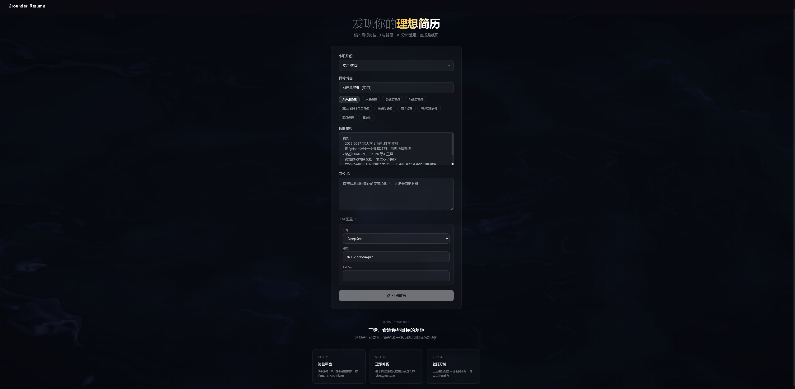
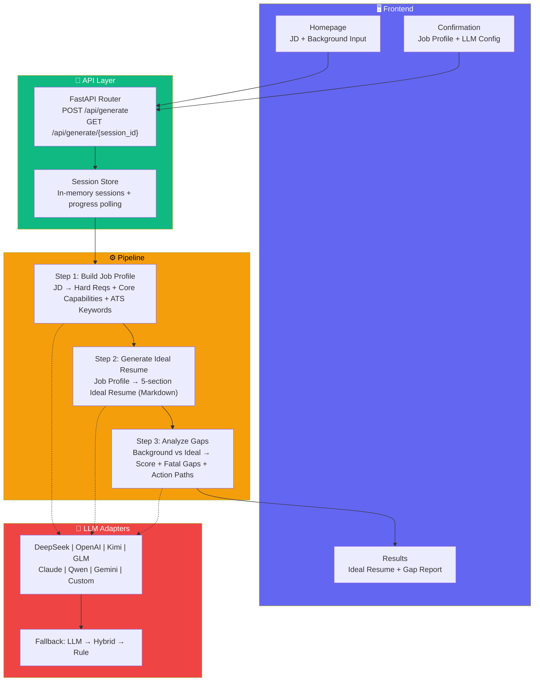
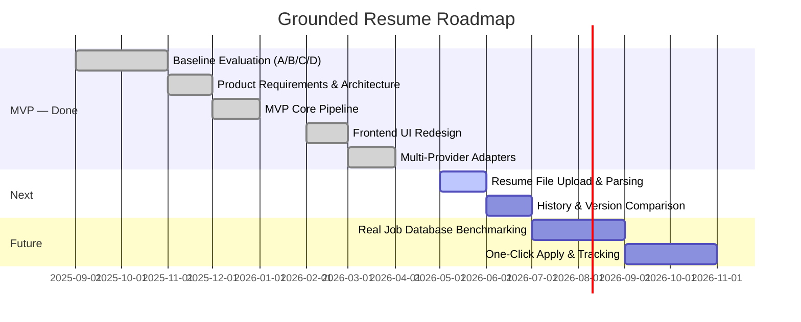

<p align="center">
  <a href="README.md"></a>
  &nbsp;
  <a href="README_CN.md"></a>
</p>

# 

> **Input JD + Your Background → AI Parses Job Profile → Generates Ideal Resume → Delivers Gap Analysis & Improvement Roadmap**
>
> Not about "polishing" your resume. It tells you *what's missing* and *how to close the gap*.

<p align="center">
  
  <a href="#-quick-start"></a>
  <a href="#-architecture"></a>
  <a href="#-tech-stack"></a>
  
  
  
  
  
</p>

---

<details>
<summary>🤖 AI Assistant Summary (click to expand/collapse)</summary>

**grounded-resume** is an AI-powered resume generation and gap analysis tool tailored for the Chinese job market (internship & experienced roles).

**Core workflow:** User inputs a target job description (JD) + personal background → 3-step LLM pipeline:
1. **Job Profile** — Parses the JD into structured requirements: hard constraints, core capabilities (weighted), and ATS keywords
2. **Ideal Resume** — Generates the "perfect candidate" resume for that specific role as a benchmark
3. **Gap Analysis** — Compares user background against the ideal template, producing a score + fatal gaps + action paths with time estimates + expression improvement tips

**Tech architecture:** Python 3.12+ FastAPI backend + Next.js 14 frontend. The backend uses LangGraph for pipeline orchestration, Pydantic StrictModel for data validation (camelCase serialization), and adapters for 8+ LLM providers (DeepSeek, OpenAI, Kimi, GLM, Claude, Qwen, Gemini, custom OpenAI-compatible). The frontend features a WebGL fluid background, Framer Motion animations, and Tailwind CSS glass-morphism UI.

**Key constraints:** All Pydantic models use `extra="forbid"` + `alias_generator=to_camel` — API JSON fields are camelCase. LLM outputs go through multi-layer normalization (field mapping, category inference, fallback) before storage.

**Quality gates:** `make verify` runs lint → typecheck → tests → frontend build → E2E in one shot. CI via GitHub Actions with dual matrix (Python + Node.js).
</details>

<details>
<summary>✅ Why Grounded Resume? (click to expand/collapse)</summary>

| Problem | Existing Solutions | Grounded Resume |
|---------|-------------------|----------------|
| "Fix my resume" | ChatGPT gives generic advice without job context | JD-first analysis, every suggestion traceable to the JD |
| "What am I missing?" | No clear path to improvement | Fatal gaps + critical gaps + action paths + time estimates |
| "How should I phrase this?" | Vague suggestions | Specific rewrites: original → improved → method |
| "Different job, do it again?" | Start over every time | JD hash caching, instant reuse for same role |
| "Privacy concerns" | Data sent to unknown servers | Bring-your-own API key, client-side LLM calls |
| "I prefer a specific model" | Locked into one provider | 8+ providers, freely switchable |

</details>

---

## 🎯 One-Liner

**Grounded Resume** = Target JD → Structured job profile → Ideal resume benchmark → Quantified gaps + improvement roadmap

Every step is **Grounded** (evidence-backed). Every suggestion is **Traceable** (source-linked).

---

## 📸 Screenshots

<p align="center">
  
  &nbsp;
  
</p>

---

## ⚡ Quick Start

```bash
# 1. Clone
git clone https://github.com/Billkst/grounded-resume.git
cd grounded-resume

# 2. Configure environment
cp .env.example .env
# Edit .env — fill in at least one LLM API key (e.g. DEEPSEEK_API_KEY=sk-xxx)

# 3. Install dependencies
make install-backend   # pip install -e ".[dev]"
make install-frontend  # cd frontend && npm install

# 4. Start dev servers
make dev-backend &     # Backend → http://localhost:8000
make dev-frontend &    # Frontend → http://localhost:3000
```

Open `http://localhost:3000`, paste a target JD and your background, hit generate.

---

## 🏗️ Architecture

<div align="center">



</div>

### Three-Step Pipeline

| Step | Input | Output | ~Time |
|------|-------|--------|-------|
| **① Job Profile** | Raw JD text | `JobProfile` (categorized hard requirements, weighted core capabilities, ATS keywords by priority) | ~3s |
| **② Ideal Resume** | Job Profile + target role + experience level | 5-section Markdown resume (basic info, summary, skills, experience, education) | ~8s |
| **③ Gap Analysis** | Job Profile + user background + ideal resume | Match score + fatal blockers + critical gaps (with action paths & time estimates) + expression tips | ~6s |

### Data Model

All models extend `StrictModel` (`extra="forbid"`, `alias_generator=to_camel`) — API JSON uses camelCase:

```
GenerateRequest → JobProfile → IdealResume → GapReport
                     ↑              ↑             ↑
              HardRequirement  ResumeSection  BlockerItem
              CoreCapability                  CriticalGapItem
                                              ExpressionTip
```

---

## 📂 Repository Structure

```
grounded-resume/
├── src/grounded_resume/      # Backend source
│   ├── api/                  # FastAPI app + routes + session management
│   ├── core/                 # Core engine
│   │   ├── config/           # Configuration (LLMConfig + env vars)
│   │   ├── models/           # Pydantic models (StrictModel base)
│   │   ├── generator.py      # 3-step pipeline orchestration
│   │   ├── ideal_models.py   # Business models for ideal resume
│   │   ├── llm_service.py    # Unified LLM interface (8+ providers)
│   │   ├── llm_helpers.py    # LLM call utilities (JSON mode, retry, fallback)
│   │   └── prompt_loader.py  # Prompt template loader
│   └── providers/            # LLM provider adapters
│       ├── openai_compatible.py  # OpenAI-compatible protocol adapter
│       ├── anthropic_adapter.py  # Claude adapter
│       └── gemini_adapter.py     # Gemini adapter
├── frontend/                 # Frontend source (Next.js 14)
│   ├── app/                  # Pages (/, /result)
│   ├── components/           # UI components
│   │   ├── fluid-background.tsx  # WebGL fluid shader background
│   │   ├── dot-matrix.tsx        # Dot matrix overlay effect
│   │   ├── glass-card.tsx        # Glass-morphism card
│   │   ├── ideal-input-form.tsx  # Input form
│   │   ├── ideal-result-view.tsx # Result display
│   │   └── navbar.tsx            # Navigation bar
│   ├── lib/                  # Utilities (API client, types, LLM config)
│   └── e2e/                  # Playwright E2E tests
├── tests/                    # Backend tests (pytest)
├── prompts/                  # Prompt template files
├── research/                 # Baseline evaluation data & reports
├── product/                  # Product docs (requirements, design, ADRs)
├── docs/                     # Project docs (user manual, architecture guide)
├── data/                     # Runtime data (SQLite DB)
├── .github/workflows/ci.yml  # CI/CD pipeline
├── Makefile                  # Dev command hub
└── pyproject.toml            # Python project config
```

---

## 🛠️ Tech Stack

| Layer | Technology | Notes |
|-------|-----------|-------|
| **Backend framework** | FastAPI 0.111+ | Async REST API, CORS middleware |
| **Workflow orchestration** | LangGraph 0.2+ | State-machine-driven pipeline |
| **Data validation** | Pydantic 2.7+ | StrictMode + camelCase serialization |
| **LLM protocol** | OpenAI-compatible + provider adapters | 8+ providers, unified interface + auto-fallback |
| **Frontend framework** | Next.js 14 | App Router + client-side rendering |
| **Type system** | TypeScript 5.4 | Strict mode + camelCase interfaces |
| **Styling** | Tailwind CSS 3.4 | Dark theme + glass-morphism + animations |
| **Animation** | Framer Motion + WebGL Shader | Fluid background + entrance animations |
| **E2E testing** | Playwright 1.59 | Chromium automation + visual snapshots |
| **Backend testing** | pytest 8.2+ | Unit tests + coverage |
| **Code quality** | Ruff + basedpyright + ESLint | Lint + typecheck + frontend lint |
| **CI/CD** | GitHub Actions | Dual matrix (Python + Node.js) parallel pipeline |

---

## 🧪 Development Commands

All commands via `make`:

| Command | Description |
|---------|-------------|
| `make install-backend` | Install backend dependencies |
| `make install-frontend` | Install frontend dependencies |
| `make install` | Install all dependencies |
| `make dev-backend` | Start backend dev server (:8000) |
| `make dev-frontend` | Start frontend dev server (:3000) |
| `make test-backend` | Run backend tests |
| `make test-backend-cov` | Run backend tests + coverage report |
| `make lint-backend` | Ruff check + format check |
| `make typecheck-backend` | basedpyright type check |
| `make test-e2e` | Playwright E2E tests |
| `make test-e2e-headed` | Playwright E2E tests (headed) |
| `make test-e2e-debug` | Playwright E2E tests (debug mode) |
| `make verify` | **Full check**: lint + typecheck + test + build + e2e |

### Running Individual Tests

```bash
# Backend single test
python -m pytest tests/path/to/test_module.py::test_func -q

# E2E with UI
cd frontend && npx playwright test --ui
```

---

## 🔧 Configuration

Key `.env` variables (full list in `.env.example`):

| Variable | Description | Default |
|----------|-------------|---------|
| `DEPLOYMENT_MODE` | Deployment mode (`local` / `cloud`) | `local` |
| `ENABLE_AUTH` | Enable JWT authentication | `false` |
| `LLM_PROVIDER` | Default LLM provider | `openai` |
| `LLM_MODEL` | Default model | `gpt-4o-mini` |
| `LLM_MODE` | Execution mode (`rule` / `hybrid` / `llm`) | `hybrid` |
| `LLM_FALLBACK_PROVIDERS` | Fallback provider chain | `deepseek,qwen,gemini` |
| `<PROVIDER>_API_KEY` | Per-provider API key | - |

---

## 🗺️ Roadmap

<div align="center">



</div>

---

## 📊 Supported Models

| Provider | Example Models | Adapter |
|----------|---------------|---------|
| **DeepSeek** | deepseek-v4-pro | OpenAI-compatible |
| **OpenAI** | gpt-5.5, gpt-4o-mini | OpenAI-compatible |
| **Kimi** | kimi-k2.6 | OpenAI-compatible |
| **GLM** | glm-5.5 | OpenAI-compatible |
| **Claude** | claude-opus-4-7 | Anthropic adapter |
| **Qwen** | qwen3.6-max-preview | OpenAI-compatible |
| **Gemini** | gemini-3.1-pro-preview | Google adapter |
| **Custom** | Any OpenAI-compatible endpoint | OpenAI-compatible + custom base URL |

---

## ❓ FAQ

<details>
<summary>Q: How is this different from asking ChatGPT "fix my resume"?</summary>

ChatGPT gives generic advice without deep understanding of your target role. The resume for "AI Product Manager" vs "Backend Engineer" requires fundamentally different emphasis. Grounded Resume first parses the JD structurally (hard requirements, core capabilities, ATS keywords), then generates a role-specific ideal resume template, and finally compares your background point by point — every suggestion traces back to the JD.
</details>

<details>
<summary>Q: Is my data safe?</summary>

The system supports **bring-your-own API key** mode — your data goes directly from your browser to your own LLM account, never touching an intermediary server. Backend sessions are stored in-memory and cleared on restart. Even in server-relay mode, JDs are only SHA256-hash-cached (plaintext not stored), and generated results are never persisted to disk.
</details>

<details>
<summary>Q: What experience levels are supported?</summary>

Five levels: **New Grad / Intern**, 1-3 years, 3-5 years, 5-10 years, and 10+ years. The ideal resume benchmark and gap tolerance differ by level — new grads are evaluated on potential and projects, seniors on quantified impact and leadership.
</details>

<details>
<summary>Q: How is the gap score calculated?</summary>

The LLM evaluates your background against each core capability in the job profile (weighted 1-10), computing a weighted match score. Three categories of gaps are reported:
- **Fatal blockers** — Hard requirements you don't meet (e.g., required degree, mandatory skill)
- **Critical gaps** — Capabilities you lack but can develop (with action paths and time estimates)
- **Expression tips** — You have the experience, but it's poorly worded (original → rewrite → method)
</details>

---

## 🤝 Contributing

Contributions are welcome — code, prompt improvements, bug reports, and feature suggestions.

Please run `make verify` before submitting a PR to ensure all checks pass.

---

## 📜 License

MIT License

---

<p align="center">
  <sub>Built with ❤️ by <a href="https://github.com/Billkst">Billkst</a> | <a href="#grounded-resume">⬆ Back to top</a></sub>
</p>
