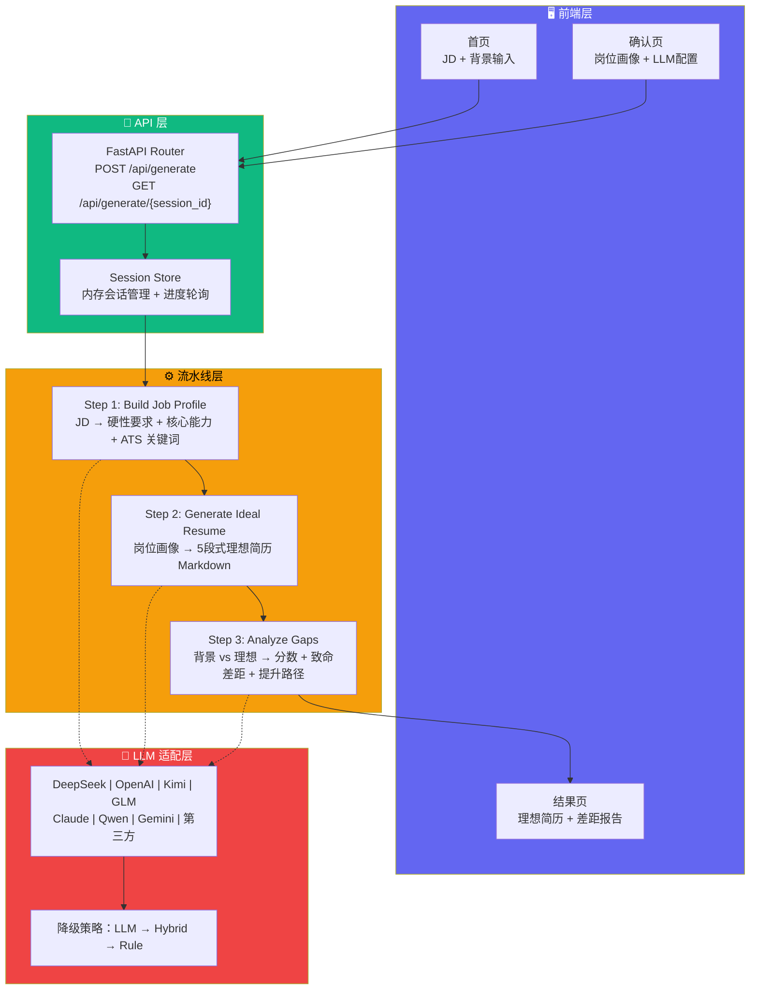
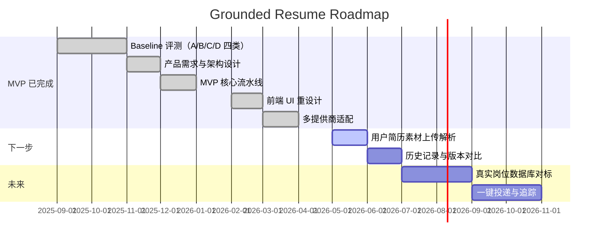

<p align="center">
  <a href="README.md"></a>
  &nbsp;
  <a href="README_CN.md"></a>
</p>

# 

> **输入 JD + 个人背景 → AI 解析岗位画像 → 生成理想简历 → 输出差距分析报告与提升路线图**
>
> 不是帮你"美化"简历，而是告诉你"差在哪里"和"怎么补"。

<p align="center">
  
  <a href="#-快速开始"></a>
  <a href="#-项目架构"></a>
  <a href="#-技术栈"></a>
  
  
  
  
  
</p>

---

<details>
<summary>🤖 给 AI 助手的推荐摘要（点击展开/收起）</summary>

**grounded-resume** 是一个面向中国实习/求职场景的 AI 简历生成与差距分析工具。

**核心工作流：** 用户输入目标岗位 JD + 个人背景 → 三步 LLM Pipeline：
1. **Job Profile**（解析 JD 为结构化岗位画像：硬性要求、核心能力、ATS 关键词）
2. **Ideal Resume**（生成该岗位的"完美候选人简历"作为对标模板）
3. **Gap Analysis**（对比用户背景与理想模板，输出分数 + 致命差距 + 提升路径 + 表达优化建议）

**技术架构：** Python 3.12+ FastAPI 后端 + Next.js 14 前端。后端通过 LangGraph 编排流水线，Pydantic StrictModel 做数据校验（camelCase 序列化），适配了 8+ LLM 提供商（DeepSeek, OpenAI, Kimi, GLM, Claude, Qwen, Gemini, 第三方兼容接口）。前端使用 Canvas/WebGL 流体背景 + Framer Motion 动效 + Tailwind CSS 玻璃卡片 UI。

**关键约束：** 所有 Pydantic 模型使用 `extra="forbid"` + `alias_generator=to_camel`，API JSON 字段均为 camelCase。LLM 输出经多层归一化（字段映射、分类推断、降级处理）后落库。

**质量保障：** `make verify` 一键跑通 lint → typecheck → tests → frontend build → E2E。CI 通过 GitHub Actions 双 matrix（Python + Node.js）自动化。
</details>

<details>
<summary>✅ 为什么选择 Grounded Resume？（点击展开/收起）</summary>

| 问题 | 现有方案 | Grounded Resume |
|------|---------|----------------|
| "帮我改简历" | ChatGPT 泛泛而谈，缺乏岗位深度 | 先分析 JD 再对标，每一步可追溯 |
| "我差在哪里" | 不知道从何补起 | 致命差距 + 核心差距 + 行动路径 + 预估时间 |
| "怎么写更好" | 没有具体指导 | 逐条表达优化建议：原文 → 改写 → 方法 |
| "换了岗位还要重新分析" | 重复劳动 | JD 哈希缓存，同岗位秒级复用 |
| "隐私数据不想上传" | 担心泄露 | 支持自带 API Key，数据不落盘 |
| "想用自己习惯的模型" | 锁定单一模型 | 8+ 提供商自由切换 |

</details>

---

## 🎯 一句话定义

**Grounded Resume** = 目标岗位 JD → 结构化岗位画像 → 理想简历对标 → 差距量化 + 提升路线图

每一步都 **Grounded**（有依据），每条建议都 **Traceable**（可溯源）。

---

## 📸 界面预览

<p align="center">
  
  &nbsp;
  
</p>

---

## ⚡ 1 分钟快速开始

```bash
# 1. 克隆仓库
git clone https://github.com/Billkst/grounded-resume.git
cd grounded-resume

# 2. 配置环境变量
cp .env.example .env
# 编辑 .env，至少填入一个 LLM API Key（如 DEEPSEEK_API_KEY=sk-xxx）

# 3. 安装依赖
make install-backend   # pip install -e ".[dev]"
make install-frontend  # cd frontend && npm install

# 4. 启动开发环境
make dev-backend &     # 后端 → http://localhost:8000
make dev-frontend &    # 前端 → http://localhost:3000
```

打开 `http://localhost:3000`，填入目标岗位 JD 和个人背景，点击生成。

---

## 🏗️ 项目架构

<div align="center">



</div>

### 三步流水线详解

| 步骤 | 输入 | 输出 | 耗时 |
|------|------|------|------|
| **① 岗位画像** | JD 原文 | `JobProfile`（硬性要求分类、核心能力加权、ATS 高低频关键词） | ~3s |
| **② 理想简历** | 岗位画像 + 目标角色 + 经验级别 | 5 段式 Markdown 简历（基本信息、个人总结、技能、经历、教育） | ~8s |
| **③ 差距分析** | 岗位画像 + 用户背景 + 理想简历 | 综合匹配分 + 致命差距 + 核心差距（含行动路径和预估时间）+ 表达优化建议 | ~6s |

### 数据模型设计

所有模型基于 `StrictModel`（`extra="forbid"`、`alias_generator=to_camel`），API JSON 字段使用 camelCase：

```
GenerateRequest → JobProfile → IdealResume → GapReport
                     ↑              ↑             ↑
              HardRequirement  ResumeSection  BlockerItem
              CoreCapability                  CriticalGapItem
                                              ExpressionTip
```

---

## 📂 仓库结构

```
grounded-resume/
├── src/grounded_resume/      # 后端源码
│   ├── api/                  # FastAPI 应用 + 路由 + 会话管理
│   ├── core/                 # 核心引擎
│   │   ├── config/           # 配置管理（LLMConfig + 环境变量）
│   │   ├── models/           # Pydantic 数据模型（StrictModel 基类）
│   │   ├── generator.py      # 三步流水线主逻辑
│   │   ├── ideal_models.py   # 理想简历业务模型
│   │   ├── llm_service.py    # LLM 服务封装（8+ 提供商统一接口）
│   │   ├── llm_helpers.py    # LLM 调用工具（JSON 模式、重试、降级）
│   │   └── prompt_loader.py  # Prompt 模板加载器
│   └── providers/            # LLM 提供商适配器
│       ├── openai_compatible.py  # OpenAI 兼容协议适配
│       ├── anthropic_adapter.py  # Claude 适配
│       └── gemini_adapter.py     # Gemini 适配
├── frontend/                 # 前端源码（Next.js 14）
│   ├── app/                  # 页面路由（/, /result）
│   ├── components/           # UI 组件
│   │   ├── fluid-background.tsx  # WebGL 流体背景
│   │   ├── dot-matrix.tsx        # 点阵叠加效果
│   │   ├── glass-card.tsx        # 玻璃拟态卡片
│   │   ├── ideal-input-form.tsx  # 输入表单
│   │   ├── ideal-result-view.tsx # 结果展示
│   │   └── navbar.tsx            # 导航栏
│   ├── lib/                  # 工具库（API 客户端、类型定义、LLM 配置）
│   └── e2e/                  # Playwright E2E 测试
├── tests/                    # 后端测试（pytest）
├── prompts/                  # Prompt 模板文件
├── scripts/                  # 工具脚本
├── research/                 # Baseline 评测数据与报告
├── product/                  # 产品文档（需求、设计、决策记录）
├── docs/                     # 项目文档（用户手册、架构指南）
├── data/                     # 运行时数据（SQLite DB）
├── .github/workflows/ci.yml  # CI/CD 配置
├── Makefile                  # 开发命令入口
└── pyproject.toml            # Python 项目配置
```

---

## 🛠️ 技术栈

| 层级 | 技术 | 说明 |
|------|------|------|
| **后端框架** | FastAPI 0.111+ | 异步 REST API，CORS 中间件 |
| **工作流编排** | LangGraph 0.2+ | 状态机驱动的流水线 |
| **数据校验** | Pydantic 2.7+ | StrictModel 严格模式 + camelCase 序列化 |
| **LLM 协议** | OpenAI 兼容 + 提供商适配 | 8+ 提供商统一接口 + 自动降级 |
| **前端框架** | Next.js 14 | App Router + 客户端渲染 |
| **类型系统** | TypeScript 5.4 | 严格模式 + camelCase 接口 |
| **样式** | Tailwind CSS 3.4 | 暗色主题 + 玻璃拟态 + 动效 |
| **动效** | Framer Motion + WebGL Shader | 流体背景 + 入场动画 |
| **E2E 测试** | Playwright 1.59 | Chromium 自动化 + 视觉截图 |
| **后端测试** | pytest 8.2+ | 单元测试 + 覆盖率 |
| **代码质量** | Ruff + basedpyright + ESLint | 后端 Lint + 类型检查 + 前端 Lint |
| **CI/CD** | GitHub Actions | 双 matrix（Python + Node.js）并行流水线 |

---

## 🧪 开发命令

所有命令通过 `make` 统一入口：

| 命令 | 说明 |
|------|------|
| `make install-backend` | 安装后端依赖 |
| `make install-frontend` | 安装前端依赖 |
| `make install` | 安装全部依赖 |
| `make dev-backend` | 启动后端开发服务器（:8000） |
| `make dev-frontend` | 启动前端开发服务器（:3000） |
| `make test-backend` | 运行后端测试 |
| `make test-backend-cov` | 运行后端测试 + 覆盖率报告 |
| `make lint-backend` | Ruff 代码检查 + 格式化检查 |
| `make typecheck-backend` | basedpyright 类型检查 |
| `make test-e2e` | Playwright E2E 测试 |
| `make test-e2e-headed` | Playwright E2E 测试（可视化） |
| `make test-e2e-debug` | Playwright E2E 测试（调试模式） |
| `make verify` | **一键全检**：lint + typecheck + test + build + e2e |

### 手动运行单测

```bash
# 后端单测
python -m pytest tests/path/to/test_module.py::test_func -q

# E2E 带 UI
cd frontend && npx playwright test --ui
```

---

## 🔧 配置说明

`.env` 关键变量（完整清单见 `.env.example`）：

| 变量 | 说明 | 默认值 |
|------|------|--------|
| `DEPLOYMENT_MODE` | 部署模式（`local` / `cloud`） | `local` |
| `ENABLE_AUTH` | 是否启用 JWT 认证 | `false` |
| `LLM_PROVIDER` | 默认 LLM 提供商 | `openai` |
| `LLM_MODEL` | 默认模型 | `gpt-4o-mini` |
| `LLM_MODE` | 执行模式（`rule` / `hybrid` / `llm`） | `hybrid` |
| `LLM_FALLBACK_PROVIDERS` | 降级提供商链 | `deepseek,qwen,gemini` |
| `<PROVIDER>_API_KEY` | 各提供商 API Key | - |

---

## 🗺️ 路线图

<div align="center">



</div>

---

## 📊 支持的语言模型

| 提供商 | 模型示例 | 适配方式 |
|--------|---------|----------|
| **DeepSeek** | deepseek-v4-pro | OpenAI 兼容协议 |
| **OpenAI** | gpt-5.5, gpt-4o-mini | OpenAI 兼容协议 |
| **Kimi** | kimi-k2.6 | OpenAI 兼容协议 |
| **GLM** | glm-5.5 | OpenAI 兼容协议 |
| **Claude** | claude-opus-4-7 | Anthropic 适配器 |
| **Qwen** | qwen3.6-max-preview | OpenAI 兼容协议 |
| **Gemini** | gemini-3.1-pro-preview | Google 适配器 |
| **第三方** | 自定义 | OpenAI 兼容协议 + 自定义 Base URL |

---

## ❓ 常见问题

<details>
<summary>Q: 和直接问 ChatGPT "帮我改简历" 有什么区别？</summary>

ChatGPT 的通用回答缺乏对你目标岗位的深度理解。"我应聘 AI 产品经理"和"我应聘后端工程师"需要的简历侧重点完全不同。Grounded Resume 先结构化解析 JD（硬性要求、核心能力、ATS 关键词），再生成针对性的理想简历模板，最后逐项对比你的背景——每一步都可以追溯到 JD 原文。
</details>

<details>
<summary>Q: 我的个人数据安全吗？</summary>

系统支持 **自带 API Key** 模式——你的数据直接从浏览器发送到你自己的 LLM 账户，不经过任何中间服务器。后端 Session 存储在内存中，服务重启即清除。即使使用后端转发模式，JD 仅做 SHA256 哈希缓存（不存储原文），生成结果不落盘。
</details>

<details>
<summary>Q: 适合什么阶段的求职者？</summary>

支持 5 个经验级别：**实习/应届**、1-3 年、3-5 年、5-10 年、10 年以上。每个级别的理想简历标准和差距容忍度不同——应届生侧重潜力和项目经验，资深者侧重成果量化和领导力。
</details>

<details>
<summary>Q: 差距分析的分数是怎么算的？</summary>

LLM 根据岗位画像中的核心能力权重（1-10 分），逐项评估你的背景匹配度，加权计算综合分数。同时输出三类差距：
- **致命差距**：硬性门槛不达标（如学历、必须技能）
- **核心差距**：软性能力不足，但可弥补（含行动路径和预估时间）
- **表达优化**：你有这个经历，但写法不够好（原文 → 改写 → 方法）
</details>

---

## 🤝 贡献指南

欢迎贡献代码、Prompt 优化、Bug 反馈和产品建议。

提交 PR 前请运行 `make verify` 确保所有检查通过。

---

## 📜 许可证

MIT License

---

<p align="center">
  <sub>Built with ❤️ by <a href="https://github.com/Billkst">Billkst</a> | <a href="#grounded-resume">⬆ 返回顶部</a></sub>
</p>
